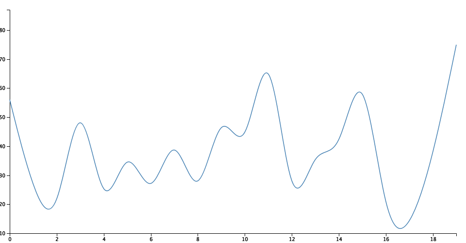

## LineChart

> Line chart generator for [markvis](https://github.com/geekplux/markvis) in browser and node.js.

[](https://npmjs.com/package/markvis-line) [](https://npmjs.com/package/markvis-line) [](https://travis-ci.org/geekplux/markvis-line) [](https://coveralls.io/github/geekplux/markvis-line) [](https://geekplux.github.io/donate)

## Install

```bash
npm install markvis-line --save

or use yarn

yarn add markvis-line --save
```

## Usage

```js
const markvisLine = require('markvis-line');
const line = markvisLine({ data, d3, d3node })
```

Check out the [example](./example) for usage.

#### Output the visualization result to a image

```
npm run example
```

#### Output Preview (png):




## API

### markvisLine({ data, d3, d3node[, selector, container, style] })

#### options

##### data

- Type: `Array`

Data from file or web processed by d3 library.

##### d3

- Type: `Object`

`d3` library which used in **browser** environment.

##### d3node

- Type: `Object`

`d3-node` library which used in **node** environment.

##### selector

- Type: `String`
- Default: `'#chart'`

DOM selector in container.

##### container

- Type: `String`
- Default: `<div id="container"><h2>Line Chart</h2><div id="chart"></div></div>`

DOM contained the visualization result.

##### style

- Type: `String`<br>
- Default: `''`

Linechart style.

##### width

- Type: `Number`<br>
- Default: `960`

SVG width for line chart.

##### height

- Type: `Number`<br>
- Default: `500`

SVG height for line chart.

##### margin

- Type: `Object`<br>
- Default: `{ top: 20, right: 20, bottom: 20, left: 20 }`

Margin of the first <g> wrapper in SVG, usually used to add axis.

##### lineWidth

- Type: `Number`<br>
- Default: `1.5`

Width of line.

##### lineColor

- Type: `string`<br>
- Default: `steelblue`

Color of line.

##### isCurve

- Type: `boolean`<br>
- Default: `true`

Whether the line chart is curve.

##### export

- Type: `boolean`<br>
- Default: `false`

Whether to export to a PNG image.

## Contributing

1. Fork it!
2. Create your feature branch: `git checkout -b my-new-feature`
3. Commit your changes: `git commit -am 'Add some feature'`
4. Push to the branch: `git push origin my-new-feature`
5. Submit a pull request :D


### LICENSE

**markvis-line** © [geekplux](https://github.com/geekplux), Released under the [MIT](./LICENSE) License.<br>
Authored and maintained by geekplux with help from contributors ([list](https://github.com/geekplux/markvis/contributors)).

> [github.com/geekplux](https://github.com/geekplux) · GitHub [@geekplux](https://github.com/geekplux) · Twitter [@geekplux](https://twitter.com/geekplux)
